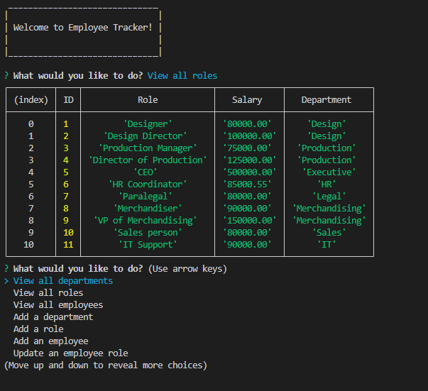

# Employee Tracker


## Description 

Command-line application to manage a company's employee database, using Node.js, Inquirer, and MySQL.

## Table of Contents

- [Installation](#installation)
- [Usage](#usage)
- [Questions](#questions)
- [License](#license)

## Installation

To install necessary dependencies, run the following command:

```npm i```

## Usage

Used for managing a company's employee database.
User able to View all departments, View all roles, View all employees, Add a department, Add a role, Add an employee, Update an employee role, and View employees by department.

Example of output when select to view all roles:

 

Link to the walkthrough video: [follow the link]()


## Questions
GitHub profile: [vlada-caban](https://github.com/vlada-caban)

## License 
  License: MIT